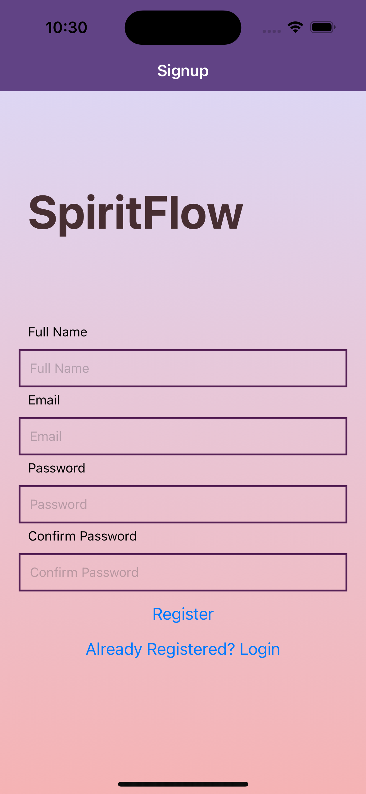
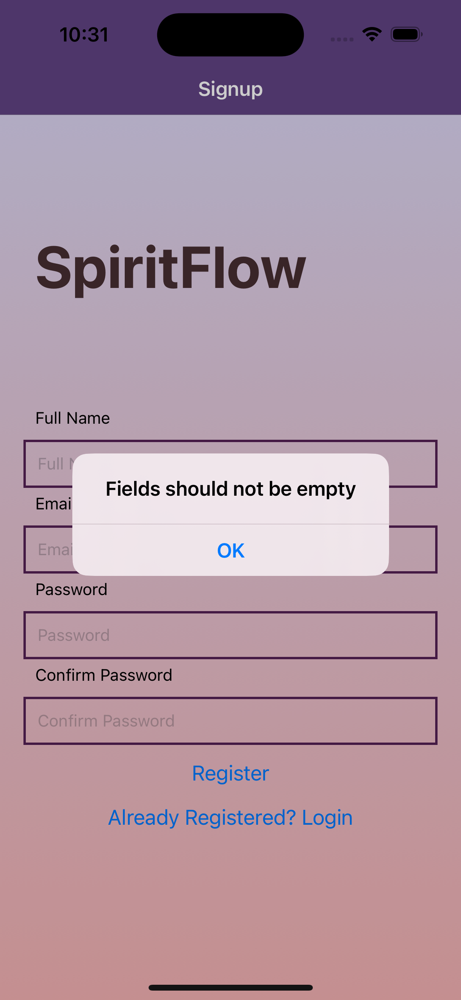

Iteration 1 / 2 / 3

Members: Judy Wang, Yingying Feng

App Introduction: 
SpiritFlow provides you with valuable insights, guiding you through life's challenges through tarot cards reading. Uncover key words and thought-provoking questions that will help you navigate your day.
In addition, our app goes beyond readings and offers personalized movie recommendations to boost your luck and inner peace, letting you embrace a journey of self-discovery and reflection through our journaling feature, allowing you to monitor your energy flows over time.

Contributions:
Create React Native components to represent the functionality of the app we are building, designed and implemented the SignUp, Login page, Authentification as well as the User Profile page, including the camera function in user profile page, desined and implemented the styles for the app(Contributed by Yingying), designed and implemented the Home, Journal, AddNewJournal, Discovery page, firestore Database, and the map location function as well as the notification function(Contributed by Judy). Worked on other files together.

Contributions for Iter3:
Judy:
   - Work on the notification function;
   - Add a linear graph in the Journal Page
   - Add icons for buttons on buttom tab
Yingying:
   - Design and improve the overall appearance of the app
   - Add logout button on every single page so that user can logout anytime they want without going back to home page.

Iteration divided:
- External API use (Iter1)
- Authentication (Iter1)
- Camera use (Iter2)
- Location use(Iter2)
- Notification (Iter3)

==================================================================================================================

Firestore Database:
In our Firestore database, we've created two primary data collections: "Tarot Cards" and "Users," with an additional sub-collection under "Users" aptly named "Journals."
The rationale behind placing the "Journal" collection under the "User" collection is to establish a clear association between each journal and its creator. This ensures that when fetching an individual journal, the corresponding uid allows us to identify the user who created that specific journal. 

-----Tarot Cards-----
-fields:

Fortune_telling (string)
img (string)
keywords (string)
name (string)
questions_to_ask (string)

-Utilization:
The "Tarot Cards" collection serves a dual purpose. Firstly, by fetching three cards daily, we dynamically display them on the "Home" page, providing users with insightful daily energy guidance. Secondly, the associated keywords are employed to retrieve movie suggestions from an external API, enhancing user experience.

-Status: Fully functioning

-----Users-----
-fields:

email (string)
fullName (string)
uid (string)
Sub-collection: "Journals"

-Utilization:
The "Users" collection is integral to our system. The unique uid acts as the key to fetch individualized journals for each user, presenting detailed information on the "Journal" screen. Additionally, this identifier will later facilitate the retrieval of journal locations for the "discovery" page.

-CRUD Operations:
addUser(user)
deleteUser(uid)
editUser(uid, updatedUser)

-Status: Fully functioning

-----Journals (Sub-collection under User)-----
-fields:

date (timestamp)
energyRating (integer)
negativeThoughts (string)
positiveThoughts (string)

-Utilization:
This sub-collection is pivotal for users to create and manage their journals. The fields within the "Journal" collection are employed during the creation of a new journal on the "Add New" page. Users can input their positive and negative thoughts, select an energy rating, and seamlessly add a new journal to their collection.

-CRUD Operations:

addJournal(uid, journal)
deleteJournal(userId, journalId)
editJournal(journalId, updatedJournal)

-Status: Fully functioning

==================================================================================================================

External API use

Our application leverages the OMDb API (https://www.omdbapi.com/) to fetch movie recommendations based on keywords generated from three tarot cards. 

API key: 2e27f579
Append following to all of our API requests:
OMDb API: http://www.omdbapi.com/?i=tt3896198&apikey=2e27f579

The process involves the following steps:

Keywords Generation:
The application generates keywords from three tarot cards, such as "confession," "passion," and "suspicion."

Movie Retrieval:
The movieService module takes these keywords as parameters, forming a search query for movies.

Random Movie Selection:
Upon successful retrieval of movie data, the application checks if movies are found (data.Search is truthy and has length > 0).
If movies are available, it randomly selects one movie from the search results.

User Interaction:
Users can initiate this process by clicking the "Daily Movie for Divine Energy" button.

Displaying Results:
The selected movie is then displayed to the user, providing an entertaining and divinely inspired movie recommendation.

-Status: Fully functioning

==================================================================================================================

Camera use

In the user profile page, the camera icon in the page allows user to click and take a picture as user profile picture. Users are allowed to retake pictures if they are not satisfied with current picture.

-Status: Fully functioning

==================================================================================================================

Location use

In the "Add New Journal" feature, location services play a crucial role in enriching the user experience. The process is as follows:

Location Options:
Users are presented with two location options:
"Locate Me": Retrieves the real-time location of the user.

Integration with Firestore:
The chosen location information is then incorporated into the journal object before being stored in the Firestore database.

The 'Discovery' screen offers a panoramic view of journals created by users, each uniquely marked by location pins. The pins, distinguished by colors, discreetly reveal the energy level (ranging from black for level 1 to red for level 5) associated with each journal. This curated glimpse into shared experiences maintains user privacy by anonymously displaying only the energy levels and fake user names at specific locations, fostering a sense of community without divulging detailed journal content.

-Status: "Locate Me" Fully functioning

==================================================================================================================

Notification

In Home Page, the button "CLick for Daily Inspiration at 9AM!" allows users to click to set and receive reminder at daily 9 a.m..

-Status: Fully functioning
==================================================================================================================

ScreenShot:
1. Signup
   
   
   

2. SignIn
    
   

3. Home (with notification)
   
    
    
   
    
   

4. UserProfile (with camera)
   
    
    
    
   

5. Journal
   

   
6. AddNewJournal (with location)
    
   

7. Discovery
   

   

